.. _amazonec2:

Cloud computing with SPARTA on Amazon EC2
=========================================

The ability to perform large scale data analysis may require computational capacity not found
on a personal computing environment. Thus, SPARTA is capable of running in the cloud or on
high performance computing environments. In the subsequent tutorial, we describe the analysis
process of computing differentially expressed genes using SPARTA and the provided ExampleData
in the cloud with Amazon EC2.

Contents:

:ref:`createawsaccount`

:ref:`maclinuxlogin`

:ref:`winlogin`

:ref:`analyzeexampledataec2`

:ref:`transferfilesec2`

.. _createawsaccount:

Create an Amazon Web Services Account
-------------------------------------

First we need to create an Amazon Web Services (AWS) account. To do this: 

#.	Navigate to the `AWS site <http://aws.amazon.com>`_

#.	In the upper right corner, click on the "Sign In to the Console" button

#.	Enter your e-mail and make sure the "I am a new user" is selected

#.	Click on the "Sign in using our secure server" button to get started creating your account

#.	Enter your information and password into the relevant fields and click "Create account"

#.	Continue to input your necessary information as denoted by the fields with an asterisk (*)

#. 	Read and click on the "I agree to the AWS terms" so that it is checked

#. 	Click on the "Create account and continue" button

#.	From here you will need to enter your credit card information so that if you decide to go beyond the "Free tier" machines, they can charge you (computing time, even on large machines is pretty cheap). Also, you will need to verify your information and select a support plan that suites you.

Now that you have created your account, we can log into the AWS console if you aren't already.
To do this:

1.	Navigate to the `AWS site <http://aws.amazon.com>`_.

2.	Click on the "My Account" in the upper right and select "AWS Management Console" from the menu options

3.	Log in with your user name and password

4.	Set your location to "N. Virginia" if you are in the midwest or another relevant location (upper right red circle) and click on EC2 (red circle on the left side of the page)

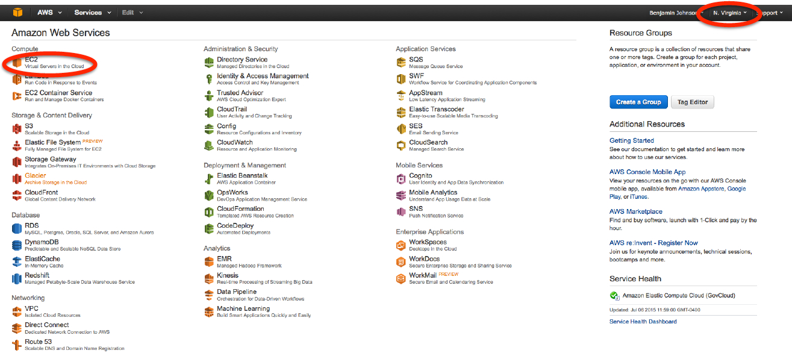
	
5.	Select "Launch Instance"

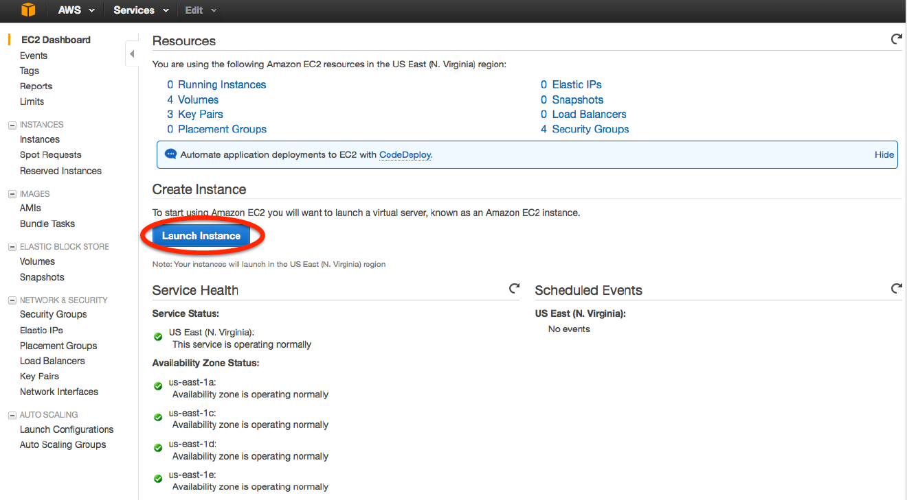
	
6.	Select the "Ubuntu Server 14.04 LTS (HVM), SSD Volume Type" machine image by clicking on "Select"

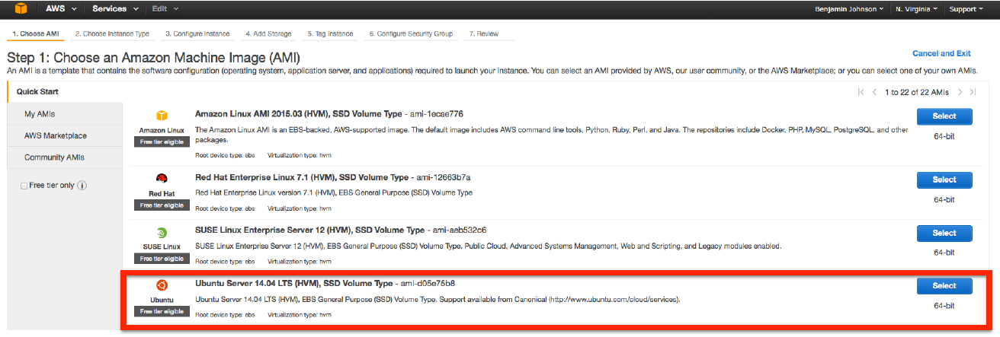
	
7.	For working with the ExampleData we do not need significant hardware capacity, so for now, select the t2.micro instance type (red box). However, if you would like to analyze your own data, either the m4.large or m4.xlarge instance types are reasonable (blue box; these instances will charge you per hour, though are quite cheap). Then, click on "Review and Launch" (orange box).

.. note: If you elect for an instance type other than the t2.micro (e.g. if you want to analyze your own data) make sure that you specify the appropriate amount of hard disk space in the "4. Add Storage" tab. The default is 8 GB which is likely not sufficient for analysis.

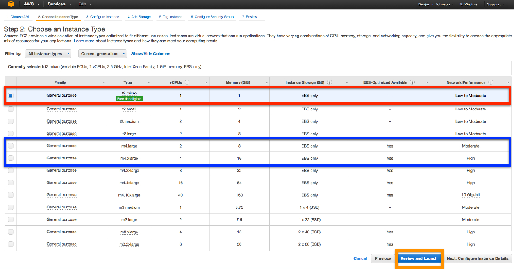
	
8.	Ignore the warning and click "Launch" (orange box)

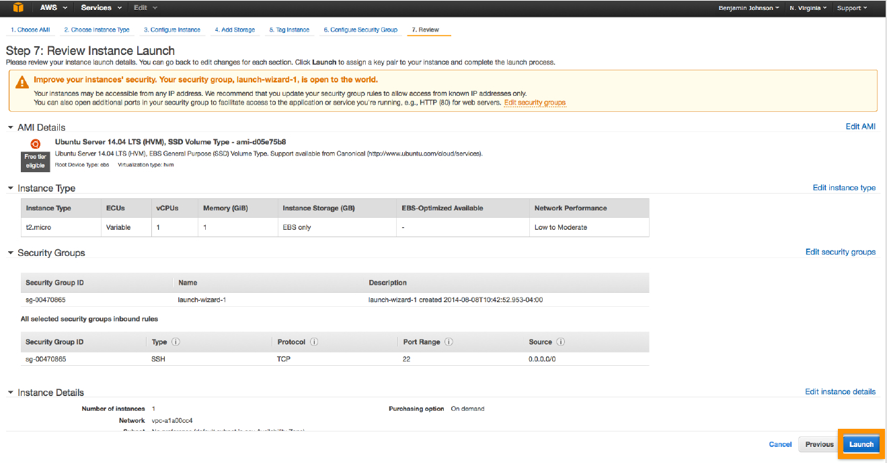
	
9.	Create a new key pair and name it "SPARTA-example" (no quotes; red arrow). Then click on "Download Key Pair". Save this .pem file. After you download and save your .pem file, click on the "Launch Instances" button.

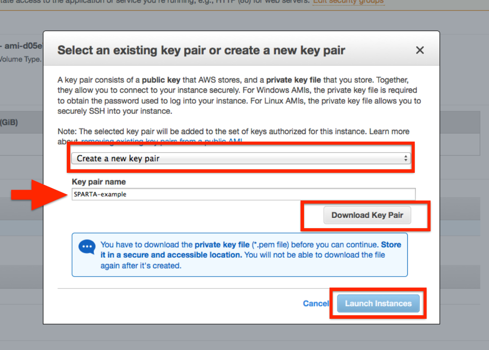
	
10.	Select the "View Instances" button and wait until your "Instance State" turns green.

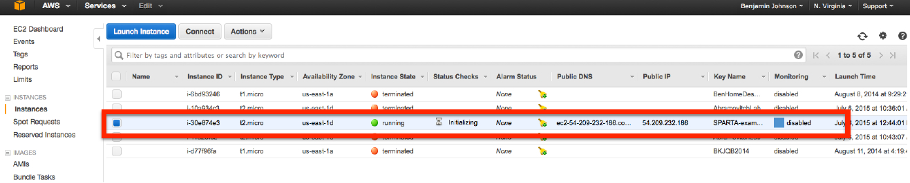
	
11.	Copy and paste the "Public DNS" into a text document (e.g. TextEdit or Notepad) and save it. This is your Amazon EC2 machine and you will need this to log into it.

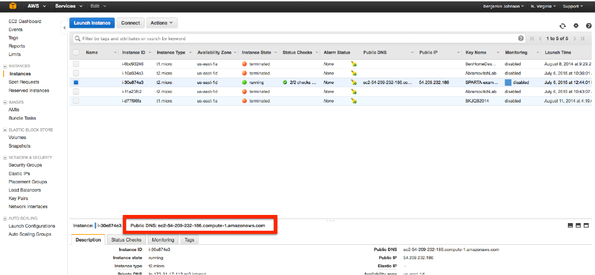
	
To log into the machine, follow either the :ref:`Mac/Linux version <maclinuxlogin>` or the :ref:`Windows version <winlogin>`

.. _maclinuxlogin:

Mac/Linux Login Procedure
-------------------------

To log into the machine you just created, we need to use the .pem file and the Terminal. If
you don't remember how to get to the terminal, see the image in the Introduction in either the :doc:`mactut` or :doc:`lintut`.

Move the .pem file from your Downloads folder to your Desktop for the time being.

Start up your terminal and type::

    cd ~/Desktop
    
This will navigate to your Desktop. We will change the permissions to read only for you, the user::

    chmod 400 SPARTA-example.pem
    
Now, let's log into our machine!

To do this we will type something like this (NOTE THE DNS ADDRESS AFTER THE 'ubuntu@' IS NOT REAL. THIS IS WHERE YOU SHOULD PUT YOUR PUBLIC DNS FROM EARLIER)::

    ssh -i ~/Desktop/SPARTA-example.pem ubuntu@ec2-your-public-dns-goes-here.compute-1.amazonaws.com
    
What you are doing is logging in using the secure shell (ssh) command with your credentials in the .pem file as the user 'ubuntu' to the machine 'ec2-...-compute-1.amazonaws.com'.
    
.. note: The first time you log in to a machine, it will prompt you saying that the RSA fingerprint can't be verified and then ask if you would like to add it to the permanent list of fingerprints. Type "y" (no quotes) and hit enter/return to add it.

You should now see something like::

    ubuntu@ip-345-67-89-10:
    
Congratulations! You're now on the cloud computer that you launched earlier!

.. _winlogin:

Windows Login Procedure
-----------------------

.. important: This procedure is only required one time per key. If you choose to generate alternative .pem files to log on to AWS EC2 machines, you can redo this procedure for each key.

To log into the machine you just created, we need to use the .pem file, a key generator called PuTTYgen, and a secure shell (ssh) client called PuTTY.

Download PuTTY and PuTTYgen from `here <http://www.chiark.greenend.org.uk/~sgtatham/putty/download.html>`_.

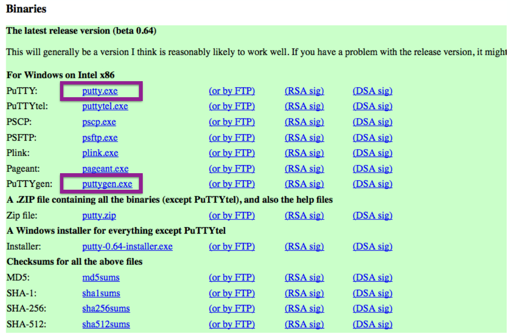
	
Move the .pem file from your Downloads folder to your Desktop for the time being.

Open up PuTTYgen and click on "Load". Navigate to your Desktop and select the SPARTA-example.pem, click "Open".

.. note: You will likely need to select "All files(*.*)" in order to display the SPARTA-example.pem file

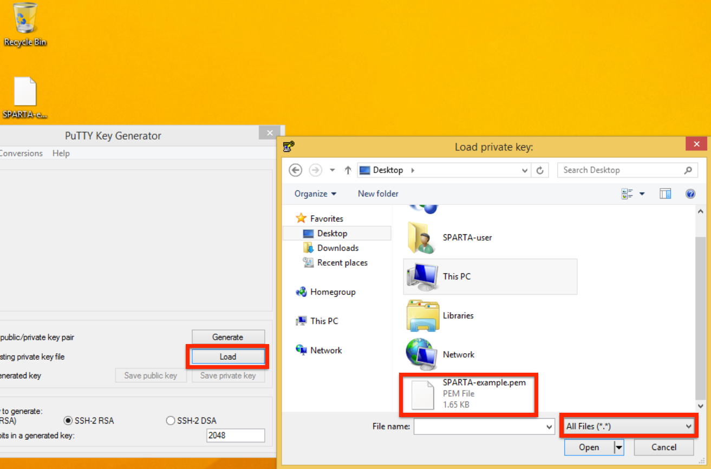
	
PuTTY should present you with a window that says something like "Successfully imported private key..."
It also states in the window that we need to use the "Save private key" command. So, let's do just that.

Click "OK"

Click on "Save private key". Save it somewhere you know where it is (reasonably easy to find is always a good idea)
It may ask you if you want to save it without a passphrase. Click "Yes". Save it as "SPARTA-example" on the Desktop (no quotes).

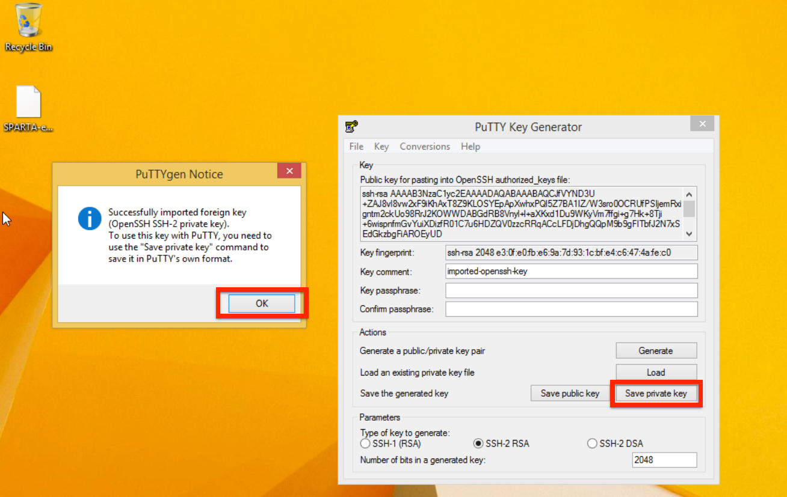
	
Now, let's log into our machine!

To do this, we will need to open up PuTTY (not PuTTYgen, which is what we were just using).
Enter the Host Name (public DNS from earlier) into the "Host Name" box.

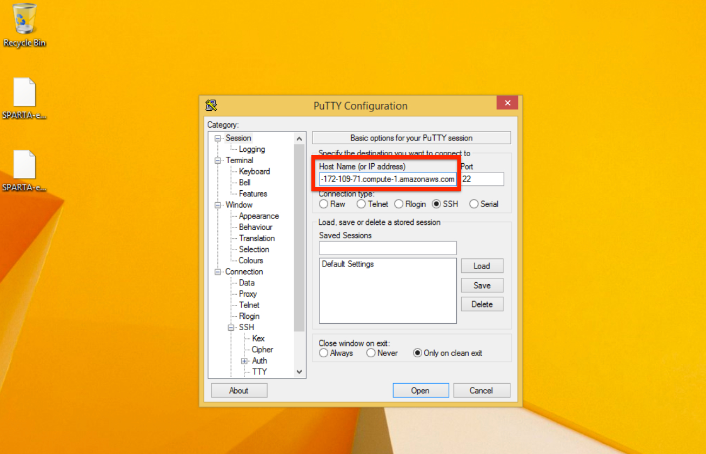
	
Look in the Category section (left-hand side of the window) and navigate to the SSH section (about halfway down the list).

Click on "Auth" in the SSH category and add your PuTTYgen key (ppk) you just made by clicking on "Browse" and selecting the ppk file. Now click "Open".

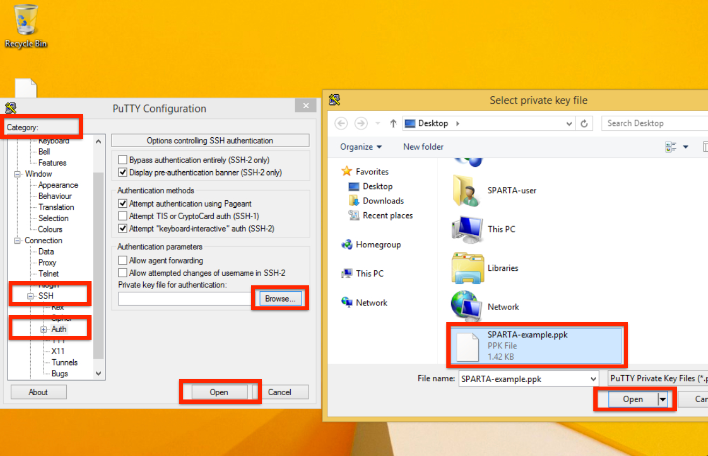
	
The first time you log into a new machine, it may prompt you with a window similar to the
one below. This is verifying the RSA fingerprint of the machine. Click "Yes".

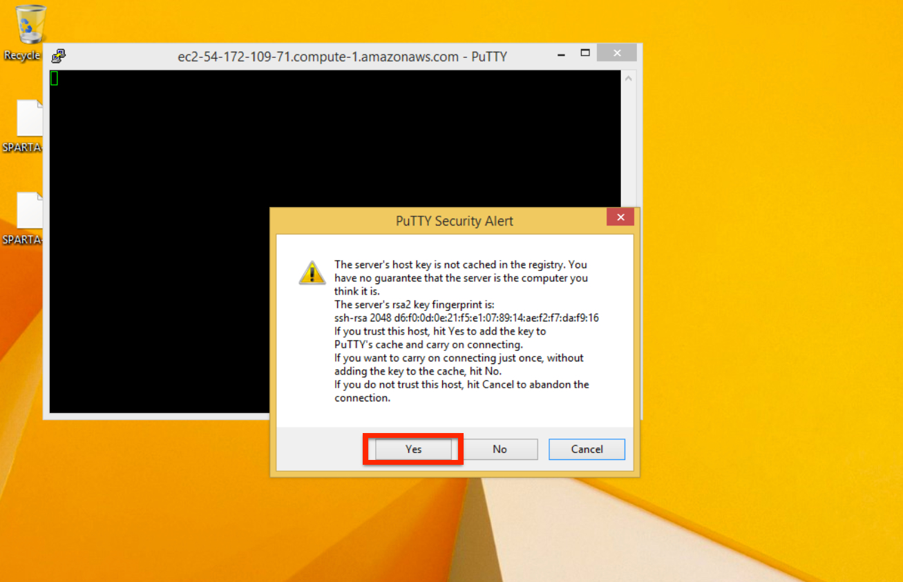

Login as "ubuntu"

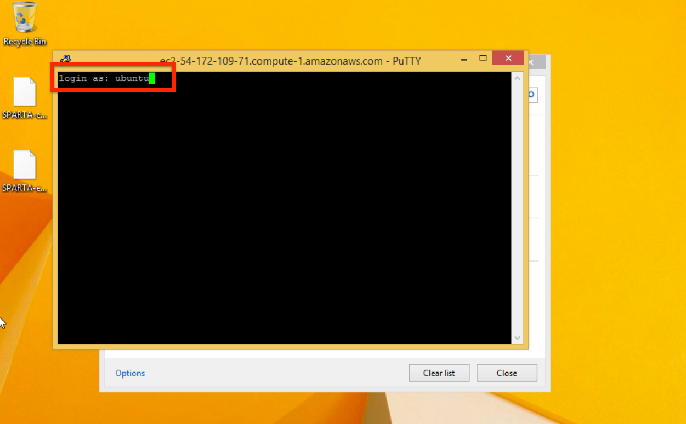
	
You should now see something like::

    ubuntu@ip-345-67-89-10:

Congratulations! You're now on the cloud computer that you launched earlier!

.. _analyzeexampledataec2:

Analyzing the RNA-seq ExampleData with SPARTA
---------------------------------------------

Now that we are logged into our Amazon EC2 machine, let's start analyzing the ExampleData
that comes with SPARTA.

To get SPARTA onto our EC2 machine, we need a tool called git. To download and install this
tool, type::

    sudo apt-get install git
    
This will begin downloading the necessary files. It will likely prompt you with a yes/no (Y/n)
question about proceeding with the install. Type::

    Y
    
Before we download SPARTA, let's make and navigate into a folder to put everything in and let's call it Desktop. Type::

    mkdir Desktop
    cd Desktop

Now, we can download SPARTA_Linux from the GitHub repository. Type::

    git clone https://github.com/biobenkj/SPARTA_Linux
    
This may take a minute or two to download the necessary files. Once they are downloaded, we
can move the ExampleData folder out of the SPARTA_Linux folder and into Desktop. To do this, type::

    cd SPARTA_Linux
    mv ExampleData ..
    
To install the dependencies, type::

    bash install_dependencies.sh
    
This will collect and install all of the dependencies necessary to run SPARTA (it will take a couple minutes).
It will likely prompt you with a yes/no (Y/n) question about proceeding. Type::

    Y

Now, we need to edit the ConfigFile.txt within SPARTA_Linux to run the workflow in non-interactive mode.

.. note: If you want to execute the workflow in *interactive* mode, you can just type: python SPARTA.py

 To open a command line editor called nano, type::

    nano ConfigFile.txt
    
The ConfigFile.txt should be displayed before you. You cannot use your mouse to move the cursor
around, but you can use the arrow keys. Navigate down to the bottom where the experimental
conditions input is. To compare all four of the experimental conditions in the ExampleData,
we need to add two more lines below "Experimental_condition_2_files:".

Before any of the files are entered, it should look like this::

    Reference_condition_files:
    Experimental_condition_2_files:
    Experimental_condition_3_files:
    Experimental_condition_4_files:
    
This is for *4* conditions. 

Now, we need to add in the file names. At this point in the analysis, the file names will
have a prefix called "map" and an extension called ".sam". So, based on the names of our
input data, we can type in the file names with the appropriate prefix and extension.

So if our input data looks like this::

    gly7a.fq.gz
    gly7b.fq.gz
    gly5a.fq.gz
    gly5b.fq.gz
    pyr7a.fq.gz
    pyr7b.fq.gz
    pyr5a.fq.gz
    pyr5b.fq.gz
    
Our files at this point in the analysis will look like this::

    mapgly7a.sam
    mapgly7b.sam
    mapgly5a.sam
    mapgly5b.sam
    mappyr7a.sam
    mappyr7b.sam
    mappyr5a.sam
    mappyr5b.sam
    
Thus, once we have added these files to the appropriate experimental conditions, it will look
like this::

    Reference_condition_files: mapgly7a.sam, mapgly7b.sam
    Experimental_condition_2_files: mapgly5a.sam, mapgly5b.sam
    Experimental_condition_3_files: mappyr7a.sam, mappyr7b.sam
    Experimental_condition_4_files: mappyr5a.sam, mappyr5b.sam
    
To save the file, hit the Control key and "O" (not the number zero). Hit enter/return. To
exit the editor, hit the Control key and "X".

Now we can run the analysis non-interactively! Type::

    python SPARTA.py --noninteractive
    
From here, the analysis will proceed from QC, aligning, counting, and differential gene expression.

Congratulations! You've analyzed the ExampleData in the cloud!

.. _transferfilesec2:

Transferring files to and from Amazon EC2 computers
---------------------------------------------------

**Mac/Linux users:**

You can use a command line tool called "scp"

An example usage to transfer the file "YourFile.txt" to your home (~) directory on an Amazon EC2 computer from your Desktop::

    scp -i ~/Desktop/SPARTA-example.pem ~/Desktop/YourFile.txt ubuntu@ec2-...-.compute-1.amazonaws.com:~
    
An example usage to transfer the file "YourFile.txt" from your home (~) directory on an Amazon EC2 computer to your Desktop::

    scp -i ~/Desktop/SPARTA-example.pem ubuntu@ec2-...-.compute-1.amazonaws.com:~ ~/Desktop/YourFile.txt
    
If you would like to transfer an entire folder/directory, add the "-r" option. Thus, to transfer
YourFolder from your Desktop to the home (~) directory on an Amazon EC2 computer::

    scp -i ~/Desktop/SPARTA-example.pem -r ~/Desktop/YourFolder ubuntu@ec2-...-.compute-1.amazonaws.com:~
    
    
**Windows users:**

You can use a client called `WinSCP <http://winscp.net/eng/download.php>`_. Click on the "Installation package" under "Download WinSCP" to initiate the download.

Follow the installer and just use the default settings.

Once the client is open:

* Host name - Your Public DNS to your EC2 machine
* User name - ubuntu
* Advanced -> SSH -> Authentication -> Private key file (click on the "..." button) -> select the PuTTYgen (.ppk) file generated earlier in the tutorial

Click "Login" to connect.

Now, you can transfer files, to and from your local machine and the EC2 machine!

